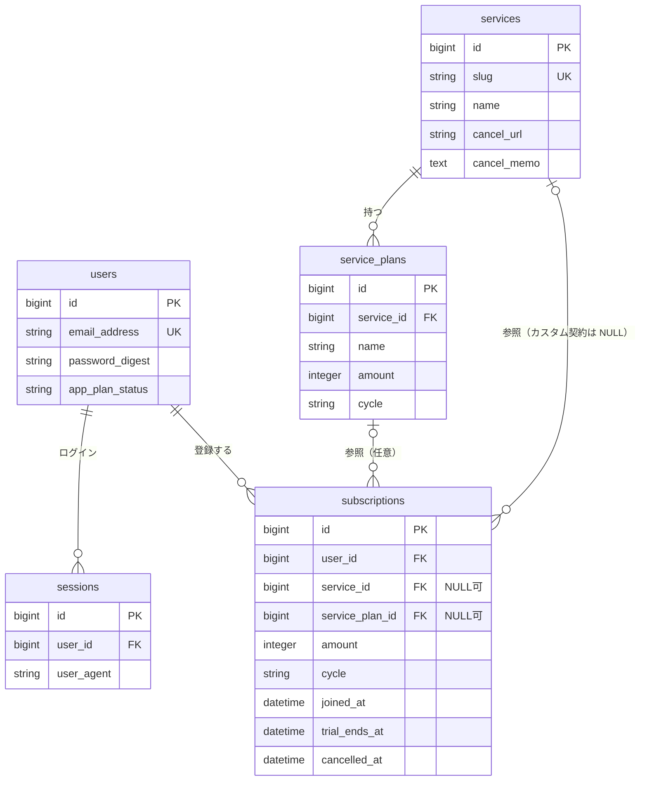

# サブマネ サーバ DB・API 設計書（Rails）

| 項目 | 内容 |
|---|---|
| 対象 | API サーバ（Ruby on Rails）と サーバ DB |
| 版 | v0.2（1st スプリント） |
| 担当 | 池田 瑞基 |
| 関連 | `README.md`（アプリ開発ガイド）、`docs/client_db.md`（クライアント側ローカル DB） |

アプリ側から見た使い方（関数・項目名・ログインの扱い）は §6 と `docs/client_db.md` を見てください。

---

## 0. 前提と方針

### 0.1 構成

| 役割 | 使うもの | 補足 |
|---|---|---|
| フレームワーク | Ruby on Rails 8（API モード） | `rails new submane-api --api` |
| DB | PostgreSQL | 開発時は SQLite でも可（マイグレーションは共通で書く） |
| 認証 | Cookie + サーバ側セッション（`sessions` テーブル） | README 5 章の決定事項。Rails 8 の認証ジェネレータを使う |
| 公開 | `https://` | README 5 章の決定事項。デプロイ先は §9 |
| テスト | Minitest（Rails 標準） | 計算ルール（§4）は必ずテストする |

### 0.2 README で決まったことの反映

| README の決定 | この設計での扱い |
|---|---|
| ログインは cookie / session | `session_id` の署名付き Cookie。DB の `sessions` テーブルで管理（§6.1） |
| 次回支払日・支払い見込みを 1 か所で計算 | **API 側で計算** してレスポンスに含める。アプリは表示するだけ（§4） |
| トライアル中の次回支払日 = トライアル終了日時 | 課金の基準日時をトライアル終了日時にする（§4.2） |
| 年額は「更新月に全額」「月割り」を選べる | 集計 API に `yearly=lump|prorated` パラメータ（§6.6） |
| 解約はユーザ自身が詳細画面で切り替える | `PATCH` で `status` を送る（§6.5） |
| アイコン画像は API から受け取る | マスタにアイコンのパスを持ち、絶対 URL で返す（§7.6） |
| 利用継続判断（バックログ No.6）はパス | 今回は扱わない |
| 更新周期は月額 / 年額 | `monthly` / `yearly` のみ |
| 入会日時は分まで | 日時で保存し、分単位の文字列で返す |

### 0.3 設計方針

1. **サービス共通情報（マスタ）とユーザの契約を分ける。** マスタは運営側（シード）で整備し、ユーザは選ぶだけにする。マイナーなサービスは名称・URL を手入力する「カスタム契約」で登録する。
2. **日付で変わる値は保存しない。** 状態（トライアル中か）・次回支払日・支払い見込みは、保存した事実（入会日時・トライアル終了日時・解約日時）から毎回計算する。
3. **外部サービスのパスワード等は保存しない。** 「退会にメールアドレス・パスワードが必要」という案内文だけを持つ。
4. **金額は契約側にコピーして持つ。** マスタの価格改定で過去の内訳が変わらないように、また割引価格などを手入力できるようにする。

---

## 1. 機能定義書との対応

| 機能定義書 No | 機能 | テーブル | API |
|---|---|---|---|
| 1 | ログイン・新規会員登録 | `users`, `sessions` | `POST /signup`, `POST /session`, `DELETE /session` |
| 2.1-1 | 契約サブスクの登録 | `subscriptions` | `POST /subscriptions` |
| 2.1-2 | 契約情報の更新・編集 | `subscriptions` | `PATCH /subscriptions/:id` |
| 2.1-3 | 契約状態変更（解約・再契約） | `subscriptions.cancelled_at` | `PATCH /subscriptions/:id`（`status`） |
| 2.1-4 | 無料トライアル状態の設定 | `subscriptions.trial_ends_at` | `POST` / `PATCH /subscriptions` |
| 2.2-1 | アイコン一覧表示 | `subscriptions` + `services` | `GET /subscriptions` |
| 2.2-2〜4 | 詳細・退会に必要な情報・入退会 URL | `services`, `subscriptions` | `GET /subscriptions/:id` |
| 2.3-1〜3 | 当月支払い見込み・円グラフ・明細 | （計算） | `GET /summary` |
| 2.4-1 | 次回更新日の自動算出 | （計算） | 各レスポンスの `next_payment_at` |
| 3.1 | 主要サブスク基本データの登録・更新・削除 | `services`, `service_plans` | シード（`db/seeds.rb`）で管理 |
| 3.2-1 | ユーザアカウント情報の管理 | `users` | `GET /me` |
| 3.2-2 | ユーザ登録サブスクデータの同期・保存 | `subscriptions` | 一覧 API を毎回取り直す（§6.4） |
| 3.2-3 | アプリ内サブスク決済状態の管理 | `users.app_plan_status` | `GET /me`（デモのため状態のみ） |

---

## 2. ER 図



ID は Rails 標準の連番（bigint）。アプリはオンラインで登録・編集する方式（`docs/client_db.md` §1）なので、端末側で ID を作る必要はない。

---

## 3. テーブル定義

全テーブルに `created_at` / `updated_at`（Rails の `t.timestamps`）を付ける。日時は UTC で保存され、Rails が `Asia/Tokyo` に変換して扱う（§7.2）。

### 3.1 `users`

Rails 8 の認証ジェネレータが作るテーブルに、アプリ課金の状態を追加する。

| カラム | 型 | NULL | 既定値 | 説明 |
|---|---|---|---|---|
| id | bigint | × | | PK |
| email_address | string | × | | ログイン ID。UNIQUE。小文字に正規化（ジェネレータの `normalizes` で実施） |
| password_digest | string | × | | `has_secure_password`（bcrypt）。平文は保存しない |
| app_plan_status | string | × | `"trial"` | 本アプリ自体の課金状態。`trial` / `active` / `expired` / `cancelled` |
| app_trial_ends_at | datetime | ○ | | 初月無料の終了日時（登録日時 + 1 か月） |

### 3.2 `sessions`

ジェネレータが作るテーブルのまま使う。1 回のログインにつき 1 行。ログアウトで削除。

| カラム | 型 | NULL | 説明 |
|---|---|---|---|
| id | bigint | × | PK。署名付き Cookie `session_id` に入る値 |
| user_id | bigint | × | FK → users.id |
| ip_address | string | ○ | ログイン元 |
| user_agent | string | ○ | ログイン元（端末の判別に使える） |

2 台の端末で同じアカウントにログインすると 2 行になる（README 11 章の同期テストはこの状態で行う）。

### 3.3 `services`（サービスマスタ）

| カラム | 型 | NULL | 既定値 | 説明 |
|---|---|---|---|---|
| id | bigint | × | | PK |
| slug | string | × | | 英数字の識別子（例 `netflix`）。UNIQUE。シードとアイコンのファイル名に使う |
| name | string | × | | 表示名（例 `Netflix`） |
| name_kana | string | ○ | | 読み（例 `ねっとふりっくす`）。名称検索用 |
| keywords | string | ○ | | 検索用の別名をスペース区切り（例 `ネトフリ netflix`） |
| category | string | ○ | | `video` / `music` / `book` / `tool` / `other` |
| icon_path | string | ○ | | アイコン画像のパス（例 `/icons/netflix.png`）。NULL ならアプリが頭文字タイルを表示 |
| color | string | ○ | | 頭文字タイルの背景色（例 `#E50914`） |
| join_url | string | ○ | | 入会ページ URL |
| cancel_url | string | ○ | | 退会ページ URL |
| cancel_memo | text | ○ | | 退会に必要な情報・手順のヒント（例「メールアドレス・パスワード。アプリ内からは解約不可」） |
| has_free_trial | boolean | × | false | 無料トライアルの有無 |
| default_trial_days | integer | ○ | | 標準のトライアル日数（登録画面の初期値用） |
| url_checked_on | date | ○ | | URL・手順を最後に確認した日（企画書 7 章「URL が変わる恐れ」への備え） |
| active | boolean | × | true | false で検索結果に出さない（登録済みの契約からの参照は残る） |

### 3.4 `service_plans`（プランマスタ）

| カラム | 型 | NULL | 既定値 | 説明 |
|---|---|---|---|---|
| id | bigint | × | | PK |
| service_id | bigint | × | | FK → services.id |
| name | string | × | | プラン名（例 `スタンダード`） |
| amount | integer | × | | 1 回の支払額（円・税込）。0 以上 |
| cycle | string | × | | `monthly` / `yearly` |
| position | integer | × | 0 | 表示順 |
| active | boolean | × | true | 販売終了プランは false |

### 3.5 `subscriptions`（ユーザの契約）

| カラム | 型 | NULL | 既定値 | 説明 |
|---|---|---|---|---|
| id | bigint | × | | PK |
| user_id | bigint | × | | FK → users.id（ユーザ削除で一緒に削除） |
| service_id | bigint | ○ | | FK → services.id。NULL ならカスタム契約 |
| service_plan_id | bigint | ○ | | FK → service_plans.id。プラン未選択・カスタム時は NULL |
| custom_name | string | ○ | | カスタム契約のサービス名。`service_id` が NULL のとき必須 |
| custom_join_url | string | ○ | | 入会 URL。入力があればマスタより優先 |
| custom_cancel_url | string | ○ | | 退会 URL。入力があればマスタより優先 |
| custom_cancel_memo | text | ○ | | 退会に必要な情報。入力があればマスタより優先 |
| plan_name | string | ○ | | 登録時点のプラン名（プランからコピー、または自由入力） |
| amount | integer | × | | 1 回の支払額（円）。プランからコピー、または手入力 |
| cycle | string | × | | `monthly` / `yearly` |
| joined_at | datetime | × | | 入会日時（分まで） |
| trial_ends_at | datetime | ○ | | 無料トライアルの終了日時。NULL ならトライアルなし |
| cancelled_at | datetime | ○ | | 解約日時。**NULL でなければ解約済み（グレー表示）** |
| memo | text | ○ | | 自由メモ |

制約・インデックス:

- `index (user_id)`、`index (service_id)`
- 同じサービスの重複登録は許可する（家族用に別アカウントを持つ場合など）
- 削除は物理削除（アプリは毎回一覧を取り直すので、削除を別途伝える必要がない）

モデルの検証は §7.4。

---

## 4. 計算ルール

計算はすべて `app/models/billing.rb`（§7.5）で行い、コントローラやシリアライザで同じ計算を書かない。
「現在」は `Time.current`（日本時間）。テストでは `travel_to` で固定する。

### 4.1 状態 `status`

```
cancelled_at がある                           → "cancelled"（グレー表示）
trial_ends_at がある かつ 現在 < trial_ends_at  → "trial"（時計マーク）
それ以外                                       → "active"
```

トライアル終了日時を過ぎると、何もしなくても `active` に変わる。

### 4.2 課金の基準日時（保存しない）

```
基準日時 = trial_ends_at があれば trial_ends_at、なければ joined_at
```

トライアルありの場合、初回の支払いがトライアル終了日時になる（README 13 章の決定）。

### 4.3 次回支払日時 `next_payment_at`

```
解約済みなら null
周期 = monthly なら 1 か月、yearly なら 12 か月
支払日時(n) = 基準日時 + n × 周期   （n = 0, 1, 2, ...）
現在より後で最も早い 支払日時(n) を返す
```

- **月末の扱い:** その月に同じ日が無いときは月末に寄せる（1/31 → 2/28 → 3/31 → 4/30）。
  必ず「基準日時 + n か月」で計算し、前回の結果に 1 か月足していかない（足していくと 2/28 以降ずっと 28 日になる）。
  Rails の `advance(months: n)` がこの動きをする。
- うるう年の 2/29 に入会した年額は、平年は 2/28 になる。

### 4.4 月の支払い見込み

対象: 状態が `active` または `trial` の契約（解約済みは含めない）。

| 計上方法 | 月額プラン | 年額プラン |
|---|---|---|
| `lump`（更新月に全額。既定） | その月に入る支払日時の回数 × 金額 | 同左（更新月だけ全額） |
| `prorated`（月割り） | 同上 | 基準日時がその月の末日以前なら `金額 ÷ 12`（四捨五入） |

- トライアル中は基準日時がトライアル終了日時なので、無料期間の月は自然に 0 円になる。
- 前月差分 = 当月の見込み − 前月の見込み。前月も **現在の契約内容** で計算する概算とする（過去の金額変更・解約は反映しない）。
- 合計は各サービスの金額（四捨五入後）を足したもの。

### 4.5 テストケース（現在 = 2026-10-05 12:00 JST）

| # | cycle | joined_at | trial_ends_at | cancelled_at | 期待 status | 期待 next_payment_at |
|---|---|---|---|---|---|---|
| 1 | monthly | 2026-04-12 10:00 | – | – | active | 2026-10-12 10:00 |
| 2 | monthly | 2026-10-05 09:00 | – | – | active | 2026-11-05 09:00（当日分は支払い済み） |
| 3 | monthly | 2026-08-31 20:00 | – | – | active | 2026-10-31 20:00 |
| 4 | monthly | 2026-01-31 20:00 | – | – | active | 2026-10-31 20:00 |
| 5 | yearly | 2025-11-01 08:00 | – | – | active | 2026-11-01 08:00 |
| 6 | yearly | 2024-02-29 10:00 | – | – | active | 2027-02-28 10:00 |
| 7 | monthly | 2026-10-01 10:00 | 2026-10-31 23:59 | – | trial | 2026-10-31 23:59 |
| 8 | monthly | 2026-09-01 10:00 | 2026-09-30 10:00 | – | active | 2026-10-30 10:00 |
| 9 | monthly | 2026-03-10 10:00 | – | 2026-09-20 15:00 | cancelled | null |

追加ケース:

- 現在 = 2026-02-10、monthly、joined_at = 2026-01-31 → `2026-02-28`
- 年をまたぐ: 現在 = 2026-12-20、monthly、joined_at = 2026-06-15 → `2027-01-15`

支払い見込み（2026-10、上の #1・#5・#7・#9 を持つユーザ。金額は #1=1,000 円、#5=12,000 円、#7=1,500 円、#9=990 円）:

| 計上方法 | 期待 total | 内訳 |
|---|---|---|
| lump | 2,500 | #1 1,000 + #7 1,500（#5 は 11 月、#9 は解約済み） |
| prorated | 3,500 | #1 1,000 + #5 1,000 + #7 1,500 |

---

## 5. API 共通仕様

| 項目 | 内容 |
|---|---|
| ベース URL | `https://<ホスト>/api/v1` |
| 形式 | JSON（UTF-8）。キーは **snake_case**（Rails 標準。README 5 章の項目名に合わせた） |
| 認証 | 署名付き Cookie `session_id`（§6.1）。ログイン・新規登録のレスポンスの `Set-Cookie` を以降のリクエストに付ける |
| 日時（返す） | 分まで・オフセット付き: `"2026-10-20T21:00+09:00"`（Python の `datetime.fromisoformat` でそのまま読める） |
| 日時（受け取る） | `"2026-10-20T21:00"`（オフセットなしは日本時間とみなす）、またはオフセット付き |
| 月 | `"2026-10"` |
| 金額 | 整数（円） |

### エラーの返し方

```json
{
  "error": {
    "code": "validation_error",
    "message": "入力内容に誤りがあります",
    "details": { "amount": ["は0以上の値にしてください"] }
  }
}
```

| HTTP | code | 主な場面 |
|---|---|---|
| 400 | `bad_request` | JSON が壊れている、必須パラメータがない |
| 401 | `unauthorized` | 未ログイン・セッション切れ・ログイン失敗 |
| 404 | `not_found` | 存在しない、または他人の契約 |
| 422 | `validation_error` | 入力チェック違反（`details` に項目ごとのメッセージ） |
| 500 | `internal_error` | サーバ内部エラー |

- 他人の契約へのアクセスは、存在を知らせないため 403 ではなく 404 にする。
- メッセージは日本語（`rails-i18n` を入れて `default_locale = :ja`）。

---

## 6. エンドポイント

| 優先 | メソッド | パス | ログイン | 概要 | `api_client.py`（README 5 章） |
|---|---|---|---|---|---|
| A | POST | `/signup` | 不要 | 会員登録（登録後そのままログイン状態） | `sign_up` |
| A | POST | `/session` | 不要 | ログイン | `log_in` |
| A | DELETE | `/session` | 要 | ログアウト | `log_out` |
| B | GET | `/me` | 要 | 自分の情報（起動時のログイン確認にも使う） | ― |
| A | GET | `/services` | 要 | 定番サービスの検索・一覧（プラン込み） | `search_services` |
| A | GET | `/subscriptions` | 要 | 自分の契約一覧 | `list_subscriptions` |
| A | GET | `/subscriptions/:id` | 要 | 契約 1 件 | `get_subscription` |
| A | POST | `/subscriptions` | 要 | 契約を登録 | `create_subscription` |
| A | PATCH | `/subscriptions/:id` | 要 | 契約を編集・解約・再契約 | `update_subscription` |
| A | DELETE | `/subscriptions/:id` | 要 | 契約を削除 | `delete_subscription` |
| A | GET | `/summary` | 要 | 月の支払い見込み・内訳・前月差分 | `get_summary` |

優先 A = 2nd スプリント（10/19〜11/1）の API 接続で必須、B = できれば。

### 6.1 認証

Cookie 名は `session_id`（署名付き・`HttpOnly`・`SameSite=Lax`・本番は `Secure`）。値は `sessions.id`。有効期限は永続（ログアウトまで）。

#### `POST /signup`

```json
// Request
{ "email": "user@example.com", "password": "password123" }

// 201 Created（Set-Cookie: session_id=...）
{
  "user": {
    "id": 1,
    "email": "user@example.com",
    "app_plan": { "status": "trial", "trial_ends_at": "2026-11-05T12:00+09:00" }
  }
}
```

- password は 8 文字以上。メールアドレスが登録済みなら 422（`details.email`）。
- JSON のキーは `email`（DB の `email_address` との変換はサーバで行う）。

#### `POST /session`

Request は signup と同じ。200 + 同じ形のレスポンス + `Set-Cookie`。
失敗時は 401「メールアドレスまたはパスワードが違います」（どちらが違うかは返さない）。

#### `DELETE /session`

現在のセッション行を削除し、Cookie を消す。204 No Content。

#### `GET /me`

200 + signup と同じ `user`。未ログインなら 401（アプリは起動時にこれでログイン画面へ移るか決める）。

### 6.2 サービスオブジェクト

```json
{
  "id": 12,
  "slug": "unext",
  "name": "U-NEXT",
  "name_kana": "ゆーねくすと",
  "category": "video",
  "icon": "https://<ホスト>/icons/unext.png",
  "color": "#000000",
  "join_url": "https://...",
  "cancel_url": "https://...",
  "cancel_memo": "メールアドレス・パスワード",
  "has_free_trial": true,
  "default_trial_days": 31,
  "plans": [
    { "id": 30, "name": "月額プラン", "amount": 2189, "cycle": "monthly" }
  ]
}
```

### 6.3 `GET /services`

| パラメータ | 説明 |
|---|---|
| `q` | 部分一致検索。対象は `name`・`name_kana`・`keywords`。大文字小文字は区別しない。省略で全件 |

```json
// 200 OK
{ "services": [ /* サービスオブジェクト */ ] }
```

`active = true` のものだけを名前順で返す。マスタは数十件の想定なので、ページングはしない。

### 6.4 契約オブジェクト

README 5 章「アプリが必要とするサブスク 1 件のデータ」の項目名に合わせている。

```json
{
  "id": 3,
  "service_id": 12,
  "name": "U-NEXT",
  "icon": "https://<ホスト>/icons/unext.png",
  "color": "#000000",
  "plan_id": 30,
  "plan_name": "月額プラン",
  "cycle": "monthly",
  "amount": 2189,
  "joined_at": "2026-09-20T21:00+09:00",
  "trial_ends_at": "2026-10-20T21:00+09:00",
  "cancelled_at": null,
  "status": "trial",
  "next_payment_at": "2026-10-20T21:00+09:00",
  "join_url": "https://...",
  "cancel_url": "https://...",
  "cancel_memo": "メールアドレス・パスワード",
  "is_custom": false,
  "memo": null,
  "created_at": "2026-09-20T21:05+09:00",
  "updated_at": "2026-09-20T21:05+09:00"
}
```

| 項目 | 説明 |
|---|---|
| `name` / `icon` / `color` / `join_url` / `cancel_url` / `cancel_memo` | カスタム入力 → マスタの順で決めた値（アプリ側で分岐しなくてよい）。カスタム契約の `icon`・`color` は null |
| `status` / `next_payment_at` | §4 の計算結果（保存していない） |
| `plan_id` | DB の `service_plan_id` |
| `is_custom` | マスタに無いサービスを手入力したものなら true |

README の表との違い: `trial_ends_at`・`cancelled_at`・`service_id`・`plan_id`・`is_custom`・`memo`・`color` を追加。

### 6.5 契約の操作

#### `GET /subscriptions`

```json
// 200 OK
{
  "subscriptions": [ /* 契約オブジェクト */ ],
  "server_time": "2026-10-05T12:00+09:00"
}
```

- 登録順（`created_at` 昇順）。並び替え（更新頻度順・期限順など）はアプリ側で行う。
- 件数が少ないのでページングも差分取得もしない。**画面を開くたびに全件取り直す** ことで、2 台の端末の内容が一致する（README 11 章の同期テスト）。
- `server_time` は計算に使った「現在」。アプリの「最終更新」表示に使える。

#### `GET /subscriptions/:id`

200 + 契約オブジェクト。

#### `POST /subscriptions`

```json
// 定番サービス（プラン選択あり）
{
  "service_id": 12,
  "plan_id": 30,
  "joined_at": "2026-09-20T21:00",
  "trial_ends_at": "2026-10-20T21:00"
}

// カスタム契約（マイナーなサービス）
{
  "custom_name": "〇〇オンラインサロン",
  "custom_join_url": "https://...",
  "custom_cancel_url": "https://...",
  "custom_cancel_memo": "会員ID・メールアドレス",
  "plan_name": "月額会員",
  "amount": 980,
  "cycle": "monthly",
  "joined_at": "2026-09-15T10:00"
}
```

受け付ける項目: `service_id`, `plan_id`, `custom_name`, `custom_join_url`, `custom_cancel_url`, `custom_cancel_memo`, `plan_name`, `amount`, `cycle`, `joined_at`, `trial_ends_at`, `memo`

サーバでの補完・チェック:

- `plan_id` があり、`amount`・`cycle`・`plan_name` が省略されていればプランからコピー
- `service_id` も `custom_name` も無ければ 422
- `plan_id` が `service_id` のプランでなければ 422
- URL は `http://` か `https://` で始まること
- `trial_ends_at` は `joined_at` 以降であること

201 Created + 契約オブジェクト。

#### `PATCH /subscriptions/:id`

送った項目だけ更新する。`null` を送るとその項目を消す（例: `"trial_ends_at": null` でトライアル解除）。
受け付ける項目: POST と同じ ＋ `status`

解約・再契約は `status` で切り替える（README 13 章「詳細画面でユーザ自身が切り替える」）。

| 送る値 | サーバの処理 |
|---|---|
| `{"status": "cancelled"}` | `cancelled_at` を現在日時にする（`cancelled_at` を一緒に送ればその日時） |
| `{"status": "active"}` | 再契約。`cancelled_at` と `trial_ends_at` を消し、`joined_at` を現在日時にする（`joined_at` を一緒に送ればその日時） |
| `{"status": "trial"}` | 受け付けない（422）。トライアルは `trial_ends_at` で設定する |

200 + 契約オブジェクト。

#### `DELETE /subscriptions/:id`

204 No Content。解約（グレー表示で残す）ではなく、一覧から完全に消す操作。

### 6.6 `GET /summary`

| パラメータ | 説明 |
|---|---|
| `month` | `"2026-10"`。省略で今月 |
| `yearly` | `lump`（更新月に全額。既定）/ `prorated`（月割り） |

```json
// 200 OK
{
  "month": "2026-10",
  "yearly": "lump",
  "total": 2500,
  "previous_total": 2189,
  "diff": 311,
  "items": [
    {
      "subscription_id": 7,
      "name": "Hulu",
      "icon": "https://<ホスト>/icons/hulu.png",
      "color": "#1CE783",
      "cycle": "monthly",
      "amount": 1500,
      "payment_dates": ["2026-10-31T23:59+09:00"]
    }
  ]
}
```

- `items` は金額の多い順。金額 0 円の契約は含めない。円グラフ・金額一覧はこの配列から作る。
- `payment_dates` はその月の支払日時（`prorated` の年額は空配列）。

---

## 7. Rails 実装メモ

### 7.1 プロジェクト作成

```bash
rails new submane-api --api -d postgresql
cd submane-api
bin/rails generate authentication   # User / Session モデル、認証の仕組みを生成
bundle add rails-i18n
```

ジェネレータは画面（HTML）向けに作られている部分があるので、生成後に次を直す。

- `SessionsController` を JSON を返す形に書き換え、`Api::V1` 名前空間へ移す
- 未ログイン時の処理（`request_authentication`）をリダイレクトから 401 の JSON に変える
- パスワードリセット関連（`PasswordsController`・メーラー）は今回使わないので削除してよい
- 会員登録（signup）は生成されないので自分で作る

### 7.2 設定

```ruby
# config/application.rb
config.time_zone = "Tokyo"
config.i18n.default_locale = :ja

# API モードでは Cookie が無効なので追加する
config.middleware.use ActionDispatch::Cookies
```

```ruby
# app/controllers/application_controller.rb
class ApplicationController < ActionController::API
  include ActionController::Cookies
  include Authentication   # ジェネレータが作る concern

  rescue_from ActiveRecord::RecordNotFound do
    render json: { error: { code: "not_found", message: "見つかりません" } }, status: :not_found
  end

  rescue_from ActionController::ParameterMissing do |e|
    render json: { error: { code: "bad_request", message: e.message } }, status: :bad_request
  end

  private

  # ジェネレータの既定（ログイン画面へリダイレクト）を上書き
  def request_authentication
    render json: { error: { code: "unauthorized", message: "ログインしてください" } }, status: :unauthorized
  end

  def render_validation_error(record)
    render json: {
      error: { code: "validation_error", message: "入力内容に誤りがあります", details: record.errors.to_hash }
    }, status: :unprocessable_entity
  end
end
```

アプリは Python（httpx）から呼ぶので、ブラウザ向けの CORS 設定は不要。

### 7.3 ルーティング

```ruby
# config/routes.rb
Rails.application.routes.draw do
  namespace :api do
    namespace :v1 do
      post   "signup",  to: "registrations#create"
      resource :session, only: %i[create destroy]
      get    "me",      to: "users#show"
      resources :services,      only: %i[index]
      resources :subscriptions, only: %i[index show create update destroy]
      get    "summary", to: "summaries#show"
    end
  end
end
```

### 7.4 マイグレーションとモデル（抜粋）

```ruby
# 追加分（users / sessions はジェネレータが作成）
add_column :users, :app_plan_status,   :string, null: false, default: "trial"
add_column :users, :app_trial_ends_at, :datetime

create_table :services do |t|
  t.string  :slug, null: false, index: { unique: true }
  t.string  :name, null: false
  t.string  :name_kana
  t.string  :keywords
  t.string  :category
  t.string  :icon_path
  t.string  :color
  t.string  :join_url
  t.string  :cancel_url
  t.text    :cancel_memo
  t.boolean :has_free_trial, null: false, default: false
  t.integer :default_trial_days
  t.date    :url_checked_on
  t.boolean :active, null: false, default: true
  t.timestamps
end

create_table :service_plans do |t|
  t.references :service, null: false, foreign_key: true
  t.string  :name,     null: false
  t.integer :amount,   null: false
  t.string  :cycle,    null: false
  t.integer :position, null: false, default: 0
  t.boolean :active,   null: false, default: true
  t.timestamps
end

create_table :subscriptions do |t|
  t.references :user,         null: false, foreign_key: { on_delete: :cascade }
  t.references :service,      foreign_key: true
  t.references :service_plan, foreign_key: true
  t.string   :custom_name
  t.string   :custom_join_url
  t.string   :custom_cancel_url
  t.text     :custom_cancel_memo
  t.string   :plan_name
  t.integer  :amount,    null: false
  t.string   :cycle,     null: false
  t.datetime :joined_at, null: false
  t.datetime :trial_ends_at
  t.datetime :cancelled_at
  t.text     :memo
  t.timestamps
end
add_check_constraint :subscriptions, "amount >= 0", name: "amount_non_negative"
add_check_constraint :subscriptions, "service_id IS NOT NULL OR custom_name IS NOT NULL", name: "service_or_custom_name"
```

```ruby
# app/models/subscription.rb
class Subscription < ApplicationRecord
  CYCLES = %w[monthly yearly].freeze

  belongs_to :user
  belongs_to :service, optional: true
  belongs_to :service_plan, optional: true

  before_validation :copy_from_plan

  validates :amount, numericality: { only_integer: true, greater_than_or_equal_to: 0 }
  validates :cycle, inclusion: { in: CYCLES }
  validates :joined_at, presence: true
  validates :custom_name, presence: true, if: -> { service_id.nil? }
  validates :custom_join_url, :custom_cancel_url,
            format: { with: %r{\Ahttps?://}, allow_blank: true }
  validate  :trial_after_join
  validate  :plan_belongs_to_service

  def display_name = custom_name.presence || service&.name
  def join_url     = custom_join_url.presence || service&.join_url
  def cancel_url   = custom_cancel_url.presence || service&.cancel_url
  def cancel_memo  = custom_cancel_memo.presence || service&.cancel_memo
  def custom?      = service_id.nil?

  private

  def copy_from_plan
    return unless service_plan
    self.amount    ||= service_plan.amount
    self.cycle     ||= service_plan.cycle
    self.plan_name ||= service_plan.name
  end

  def trial_after_join
    return if trial_ends_at.blank? || joined_at.blank?
    errors.add(:trial_ends_at, "は入会日時以降にしてください") if trial_ends_at < joined_at
  end

  def plan_belongs_to_service
    return if service_plan.nil?
    errors.add(:plan_id, "はこのサービスのプランではありません") if service_plan.service_id != service_id
  end
end
```

### 7.5 計算（`app/models/billing.rb`）

§4 のルールをここだけに書く。

```ruby
# 状態・次回支払日時・月の支払い見込みを計算する
module Billing
  module_function

  def months_per_cycle(sub) = sub.cycle == "yearly" ? 12 : 1

  def anchor(sub) = sub.trial_ends_at || sub.joined_at

  def status(sub, now: Time.current)
    return "cancelled" if sub.cancelled_at
    return "trial" if sub.trial_ends_at && now < sub.trial_ends_at
    "active"
  end

  # 基準日時から n 周期後（月末は自動で月末に寄る）
  def payment_at(sub, n) = anchor(sub).advance(months: n * months_per_cycle(sub))

  def next_payment_at(sub, now: Time.current)
    return nil if sub.cancelled_at
    m = months_per_cycle(sub)
    elapsed = (now.year - anchor(sub).year) * 12 + (now.month - anchor(sub).month)
    n = [elapsed / m, 0].max
    n += 1 while payment_at(sub, n) <= now
    payment_at(sub, n)
  end

  # range（月初〜月末）に入る支払日時の一覧
  def payments_in(sub, range)
    return [] if sub.cancelled_at
    m = months_per_cycle(sub)
    elapsed = (range.begin.year - anchor(sub).year) * 12 + (range.begin.month - anchor(sub).month)
    n = [elapsed / m - 1, 0].max
    dates = []
    loop do
      t = payment_at(sub, n)
      break if t > range.end
      dates << t if t >= range.begin
      n += 1
    end
    dates
  end

  # month: Date（その月の 1 日）、yearly: "lump" / "prorated"
  def monthly_amount(sub, month, yearly: "lump")
    return [0, []] if sub.cancelled_at
    range = month.in_time_zone.beginning_of_month..month.in_time_zone.end_of_month
    if sub.cycle == "yearly" && yearly == "prorated"
      amount = anchor(sub) <= range.end ? (sub.amount / 12.0).round : 0
      return [amount, []]
    end
    dates = payments_in(sub, range)
    [dates.size * sub.amount, dates]
  end
end
```

テストは §4.5 の表をそのまま `test/models/billing_test.rb` に入れる（`travel_to Time.zone.parse("2026-10-05 12:00")`）。

### 7.6 JSON の組み立てとアイコン

- シリアライザは PORO（`app/serializers/subscription_serializer.rb` など）で書き、`status`・`next_payment_at` は `Billing` を呼んで埋める。
- 日時の書式はヘルパーを 1 つ用意して統一する: `t&.strftime("%Y-%m-%dT%H:%M%:z")`
- アイコン画像は `public/icons/<slug>.png` に置き、`icon_path` に `/icons/<slug>.png` を入れる。JSON では `request.base_url + icon_path` の絶対 URL にして返す。
  本番で `public/` のファイルが配信される設定になっているか、デプロイ時に確認する。

### 7.7 シード

- `db/seeds/services.yml` にサービスとプランを書き、`db/seeds.rb` で `find_or_initialize_by(slug:)` して投入する（何度実行しても重複しない）。
- 初期候補はホーム画面モックの 18 件 + 企画書 UI イメージの ChatGPT:
  Netflix / Spotify / Audible / U-NEXT / Amazonプライム / YouTube Premium / Disney+ / FODプレミアム / DAZN / Apple Music / Adobe CC / Hulu / Kindle Unlimited / Lemino / ABEMAプレミアム / iCloud+ / dアニメストア / NHKオンデマンド / ChatGPT
- プラン・金額・URL・退会に必要な情報の調査はマスタ担当（計画上は西内）。調べた日を `url_checked_on` に入れる。
- 開発用にデモユーザと契約数件も入れておく（ダミーデータ `dummy_data.py` と同じ内容にすると切り替え時に比較しやすい）。

---

## 8. スプリントごとの作業

| スプリント | 作業 |
|---|---|
| 1st（〜10/18） | プロジェクト作成、マイグレーション、モデルと検証、`Billing` とテスト、シードの枠組み、この設計書の共有 |
| 2nd（10/19〜11/1） | 認証・各エンドポイント、デプロイ（https）、アプリの `api_client.py` との接続確認 |
| 3rd（11/2〜） | 結合テストのバグ修正、マスタデータの追加・修正 |

アプリ側が 1st スプリント中にダミーデータで画面を作れるよう、§6 のレスポンス例を `dummy_data.py` の形として先に渡す。

---

## 9. 未決事項

| # | 項目 | 論点 | 提案 |
|---|---|---|---|
| 1 | デプロイ先 | https が自動で付き、PostgreSQL が使えるところ | Render などの PaaS。2nd スプリント前半に決める |
| 2 | 開発中の接続先 | `flet run`（PC）からローカルの Rails（`http://localhost:3000`）に繋ぐか | 開発中は localhost、実機確認はデプロイ先 |
| 3 | トライアル終了日の入力 | 登録画面で日付だけ入力する場合の時刻 | アプリ側で入会日時と同じ時刻を補って送る |
| 4 | 前月差分の精度 | 過去の金額変更・解約を反映しない概算でよいか | デモでは概算で可 |
| 5 | アプリ課金状態 | 状態を表示する画面を作るか | `GET /me` で返すだけにしておき、画面は余裕があれば |
