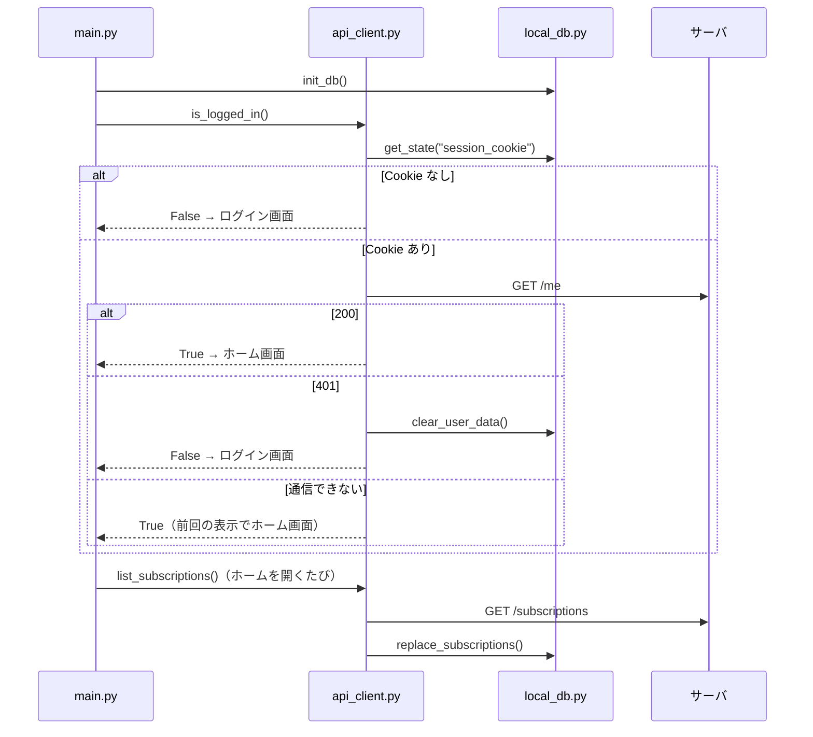

# サブマネ クライアント ローカル DB 設計書（Flet アプリ）

| 項目 | 内容 |
|---|---|
| 対象 | Android アプリ（Python / Flet）の端末内データ保存と、API との受け渡し |
| 版 | v0.2（1st スプリント） |
| 担当 | 池田 瑞基 |
| 関連 | `README.md`（アプリ開発ガイド）、`docs/server_db_api.md`（サーバ DB・API） |

画面担当の人は、**§5（画面から見た使い方）だけ読めば十分** です。

---

## 1. ローカル DB の役割

アプリのデータの正（本物）はサーバの DB です。端末内の DB は次の 3 つのためだけに使います。

| 役割 | 内容 |
|---|---|
| ① ログイン状態を残す | アプリを閉じても再ログインしなくて済むよう、セッション Cookie を保存する |
| ② 前回の表示を残す | 通信できないとき・起動直後に、前回取得した一覧・詳細・内訳を表示する |
| ③ 設定を残す | 年額プランの計上方法（更新月に全額 / 月割り）など、端末ごとの設定 |

### 決めたこと

- **登録・編集・解約・削除はオンラインのときだけ行う。** 通信できないときはエラーを出し、端末に溜めて後で送ることはしない（デモ期間内で同期の不具合を作らないため）。
- **画面を開くたびにサーバから全件取り直し、端末の DB を丸ごと置き換える。** 件数が少ないのでこれで十分速く、2 台の端末の内容も自然に一致する（README 11 章の同期テスト）。
- **次回支払日・状態・支払い見込みは API が計算した値をそのまま保存・表示する。** README 7 章の「API 側で計算する場合」に当たるので、`src/logic/` は作らない。
- 外部サービスのパスワードは端末にも保存しない。

---

## 2. 使う技術

| 項目 | 内容 |
|---|---|
| DB | SQLite（Python 標準の `sqlite3`。追加インストール不要） |
| ファイルの場所 | 環境変数 `FLET_APP_STORAGE_DATA` のフォルダ（Android ではアプリ専用領域）の `submane.db`。未設定のとき（`flet run` の PC など）は `~/.submane/submane.db` |
| 接続 | 関数を呼ぶたびに開いて閉じる（Flet のイベント処理は別スレッドで動くことがあり、接続を使い回すとエラーになるため） |
| スキーマの更新 | `PRAGMA user_version` で版を管理し、起動時に必要なら作り直す（中身はキャッシュなので消えても困らない） |

**要確認:** `FLET_APP_STORAGE_DATA` は Flet のバージョンによって使えない場合があります。`pyproject.toml` で固定したバージョンで、APK でもファイルが残ることを 1st スプリント中に確かめます。

---

## 3. テーブル定義

キャッシュなので、API の JSON を `data` 列にそのまま入れ、検索・並び替えに使う項目だけを列に出しています。API に項目が増えても、端末の DB を直す必要はありません。

### 3.1 `app_state`（ログイン状態・設定）

| カラム | 型 | 説明 |
|---|---|---|
| key | TEXT PK | キー |
| value | TEXT | 値 |

使うキー:

| key | value の例 | 消すタイミング |
|---|---|---|
| `session_cookie` | Rails が返した `session_id` Cookie の値 | ログアウト・401 を受けたとき |
| `user_email` | `user@example.com` | ログアウト時 |
| `yearly_mode` | `lump`（更新月に全額）/ `prorated`（月割り） | 消さない（端末の設定） |
| `subscriptions_fetched_at` | `2026-10-05T12:00+09:00`（API の `server_time`） | ログアウト時 |

### 3.2 `subscriptions_cache`（自分の契約）

| カラム | 型 | 説明 |
|---|---|---|
| id | INTEGER PK | 契約 ID（API の `id`） |
| position | INTEGER | API が返した順番（＝登録順） |
| status | TEXT | `active` / `trial` / `cancelled` |
| next_payment_at | TEXT | 次回支払日時（期限画面の並び替え用） |
| data | TEXT | 契約オブジェクトの JSON 全体（`docs/server_db_api.md` §6.4） |

### 3.3 `services_cache`（定番サービスのマスタ）

| カラム | 型 | 説明 |
|---|---|---|
| id | INTEGER PK | サービス ID |
| name | TEXT | サービス名 |
| name_kana | TEXT | 読み |
| data | TEXT | サービスオブジェクトの JSON 全体（プラン含む） |

登録画面の検索は通常 API（`GET /services?q=`）で行い、通信できないときだけこのテーブルを名前で検索します。

### 3.4 `summary_cache`（内訳画面）

| カラム | 型 | 説明 |
|---|---|---|
| month | TEXT | `2026-10` |
| yearly | TEXT | `lump` / `prorated` |
| data | TEXT | `GET /summary` の JSON 全体 |
| fetched_at | TEXT | 取得日時 |

主キーは `(month, yearly)`。

### 3.5 CREATE 文

```sql
CREATE TABLE IF NOT EXISTS app_state (
  key   TEXT PRIMARY KEY,
  value TEXT
);

CREATE TABLE IF NOT EXISTS subscriptions_cache (
  id              INTEGER PRIMARY KEY,
  position        INTEGER NOT NULL,
  status          TEXT    NOT NULL,
  next_payment_at TEXT,
  data            TEXT    NOT NULL
);

CREATE TABLE IF NOT EXISTS services_cache (
  id        INTEGER PRIMARY KEY,
  name      TEXT NOT NULL,
  name_kana TEXT,
  data      TEXT NOT NULL
);

CREATE TABLE IF NOT EXISTS summary_cache (
  month      TEXT NOT NULL,
  yearly     TEXT NOT NULL,
  data       TEXT NOT NULL,
  fetched_at TEXT NOT NULL,
  PRIMARY KEY (month, yearly)
);
```

---

## 4. `src/local_db.py`

README 3 章のディレクトリ構成に `src/local_db.py` と `tests/test_local_db.py` を追加します。
**このファイルを呼ぶのは `api_client.py` だけ** にし、画面（`views/`）からは直接使いません。

```python
"""端末内の SQLite(ログイン状態・設定・前回取得したデータのキャッシュ)。"""
import json
import os
import sqlite3
from contextlib import closing
from pathlib import Path

SCHEMA_VERSION = 1
_db_path: Path | None = None

_SCHEMA = """
CREATE TABLE IF NOT EXISTS app_state (key TEXT PRIMARY KEY, value TEXT);
CREATE TABLE IF NOT EXISTS subscriptions_cache (
  id INTEGER PRIMARY KEY, position INTEGER NOT NULL, status TEXT NOT NULL,
  next_payment_at TEXT, data TEXT NOT NULL);
CREATE TABLE IF NOT EXISTS services_cache (
  id INTEGER PRIMARY KEY, name TEXT NOT NULL, name_kana TEXT, data TEXT NOT NULL);
CREATE TABLE IF NOT EXISTS summary_cache (
  month TEXT NOT NULL, yearly TEXT NOT NULL, data TEXT NOT NULL,
  fetched_at TEXT NOT NULL, PRIMARY KEY (month, yearly));
"""

# ログアウトしても残すキー(端末の設定)
_KEEP_ON_LOGOUT = {"yearly_mode"}


def _default_path() -> Path:
    """DBファイルの場所を決める。"""
    base = os.getenv("FLET_APP_STORAGE_DATA")
    folder = Path(base) if base else Path.home() / ".submane"
    folder.mkdir(parents=True, exist_ok=True)
    return folder / "submane.db"


def init_db(path: Path | None = None) -> None:
    """起動時に1回呼ぶ。テストでは一時ファイルのパスを渡す。"""
    global _db_path
    _db_path = path or _default_path()
    with closing(sqlite3.connect(_db_path)) as con, con:
        version = con.execute("PRAGMA user_version").fetchone()[0]
        if version != SCHEMA_VERSION:
            # キャッシュなので、版が変わったら作り直す(設定は消える)
            for table in ("app_state", "subscriptions_cache", "services_cache", "summary_cache"):
                con.execute(f"DROP TABLE IF EXISTS {table}")
        con.executescript(_SCHEMA)
        con.execute(f"PRAGMA user_version = {SCHEMA_VERSION}")


def _connect() -> sqlite3.Connection:
    """呼ぶたびに新しい接続を開く(スレッドをまたいで使い回さない)。"""
    if _db_path is None:
        raise RuntimeError("init_db() を先に呼んでください")
    con = sqlite3.connect(_db_path)
    con.row_factory = sqlite3.Row
    return con


# ---------- ログイン状態・設定 ----------

def get_state(key: str, default: str | None = None) -> str | None:
    """app_state から値を読む。"""
    with closing(_connect()) as con:
        row = con.execute("SELECT value FROM app_state WHERE key = ?", (key,)).fetchone()
    return row["value"] if row else default


def set_state(key: str, value: str | None) -> None:
    """app_state に値を書く。None なら削除。"""
    with closing(_connect()) as con, con:
        if value is None:
            con.execute("DELETE FROM app_state WHERE key = ?", (key,))
        else:
            con.execute(
                "INSERT INTO app_state (key, value) VALUES (?, ?) "
                "ON CONFLICT(key) DO UPDATE SET value = excluded.value",
                (key, value),
            )


def clear_user_data() -> None:
    """ログアウト・401 のときに呼ぶ。設定以外をすべて消す。"""
    keep = ",".join("?" * len(_KEEP_ON_LOGOUT))
    with closing(_connect()) as con, con:
        con.execute(f"DELETE FROM app_state WHERE key NOT IN ({keep})", tuple(_KEEP_ON_LOGOUT))
        con.execute("DELETE FROM subscriptions_cache")
        con.execute("DELETE FROM services_cache")
        con.execute("DELETE FROM summary_cache")


# ---------- 契約 ----------

def replace_subscriptions(items: list[dict], fetched_at: str) -> None:
    """一覧を丸ごと置き換える(GET /subscriptions の結果)。"""
    with closing(_connect()) as con, con:
        con.execute("DELETE FROM subscriptions_cache")
        con.executemany(
            "INSERT INTO subscriptions_cache (id, position, status, next_payment_at, data) "
            "VALUES (?, ?, ?, ?, ?)",
            [(s["id"], i, s["status"], s.get("next_payment_at"), json.dumps(s, ensure_ascii=False))
             for i, s in enumerate(items)],
        )
        con.execute(
            "INSERT INTO app_state (key, value) VALUES ('subscriptions_fetched_at', ?) "
            "ON CONFLICT(key) DO UPDATE SET value = excluded.value",
            (fetched_at,),
        )


def upsert_subscription(item: dict) -> None:
    """登録・編集が成功したあと、その1件だけ反映する。"""
    with closing(_connect()) as con, con:
        row = con.execute("SELECT position FROM subscriptions_cache WHERE id = ?", (item["id"],)).fetchone()
        if row:
            position = row["position"]
        else:
            position = con.execute("SELECT COALESCE(MAX(position), -1) + 1 FROM subscriptions_cache").fetchone()[0]
        con.execute(
            "INSERT OR REPLACE INTO subscriptions_cache (id, position, status, next_payment_at, data) "
            "VALUES (?, ?, ?, ?, ?)",
            (item["id"], position, item["status"], item.get("next_payment_at"),
             json.dumps(item, ensure_ascii=False)),
        )
        # 契約が変わると内訳の結果も変わるので捨てる
        con.execute("DELETE FROM summary_cache")


def delete_subscription(sub_id: int) -> None:
    """削除が成功したあと、その1件を消す。"""
    with closing(_connect()) as con, con:
        con.execute("DELETE FROM subscriptions_cache WHERE id = ?", (sub_id,))
        con.execute("DELETE FROM summary_cache")


def load_subscriptions() -> list[dict]:
    """前回取得した一覧(登録順)。"""
    with closing(_connect()) as con:
        rows = con.execute("SELECT data FROM subscriptions_cache ORDER BY position").fetchall()
    return [json.loads(r["data"]) for r in rows]


def load_subscription(sub_id: int) -> dict | None:
    """前回取得した1件。"""
    with closing(_connect()) as con:
        row = con.execute("SELECT data FROM subscriptions_cache WHERE id = ?", (sub_id,)).fetchone()
    return json.loads(row["data"]) if row else None


# ---------- 定番サービス ----------

def replace_services(items: list[dict]) -> None:
    """マスタを丸ごと置き換える(GET /services の q なしの結果)。"""
    with closing(_connect()) as con, con:
        con.execute("DELETE FROM services_cache")
        con.executemany(
            "INSERT INTO services_cache (id, name, name_kana, data) VALUES (?, ?, ?, ?)",
            [(s["id"], s["name"], s.get("name_kana"), json.dumps(s, ensure_ascii=False)) for s in items],
        )


def search_services(keyword: str) -> list[dict]:
    """オフライン時の名称検索(名前・読みの部分一致)。"""
    like = f"%{keyword}%"
    with closing(_connect()) as con:
        rows = con.execute(
            "SELECT data FROM services_cache WHERE name LIKE ? OR name_kana LIKE ? ORDER BY name",
            (like, like),
        ).fetchall()
    return [json.loads(r["data"]) for r in rows]


# ---------- 内訳 ----------

def save_summary(month: str, yearly: str, data: dict, fetched_at: str) -> None:
    """GET /summary の結果を保存する。"""
    with closing(_connect()) as con, con:
        con.execute(
            "INSERT OR REPLACE INTO summary_cache (month, yearly, data, fetched_at) VALUES (?, ?, ?, ?)",
            (month, yearly, json.dumps(data, ensure_ascii=False), fetched_at),
        )


def load_summary(month: str, yearly: str) -> dict | None:
    """前回取得した内訳。"""
    with closing(_connect()) as con:
        row = con.execute(
            "SELECT data FROM summary_cache WHERE month = ? AND yearly = ?", (month, yearly)
        ).fetchone()
    return json.loads(row["data"]) if row else None
```

---

## 5. 画面から見た使い方（`api_client.py` の約束）

画面は今までどおり **`api_client.py` の関数だけ** を呼びます。ローカル DB を使うかどうかは `api_client.py` の中で決まり、画面は意識しません（README 5 章「アプリ側のルール」と同じ考え方）。

### 5.1 関数と API・ローカル DB の対応

| 関数（README 5 章） | API | 通信できたとき | 通信できないとき |
|---|---|---|---|
| `sign_up(email, password)` | `POST /signup` | Cookie とメールを保存 | エラー |
| `log_in(email, password)` | `POST /session` | Cookie とメールを保存 | エラー |
| `log_out()` | `DELETE /session` | `clear_user_data()` | それでも `clear_user_data()` してログイン画面へ |
| `list_subscriptions()` | `GET /subscriptions` | `replace_subscriptions()` して返す | `load_subscriptions()` を返す |
| `get_subscription(sub_id)` | `GET /subscriptions/:id` | `upsert_subscription()` して返す | `load_subscription()` を返す |
| `create_subscription(data)` | `POST /subscriptions` | `upsert_subscription()` して返す | エラー |
| `update_subscription(sub_id, data)` | `PATCH /subscriptions/:id` | `upsert_subscription()` して返す | エラー |
| `delete_subscription(sub_id)` | `DELETE /subscriptions/:id` | `delete_subscription()` | エラー |
| `search_services(keyword)` | `GET /services?q=` | そのまま返す | `local_db.search_services()` を返す |
| `get_summary(month)` | `GET /summary` | `save_summary()` して返す | `load_summary()` を返す |

追加を提案する関数:

| 関数 | 内容 |
|---|---|
| `is_logged_in()` | 起動時に使う。保存した Cookie があれば `GET /me` で確認し、401 ならログイン画面へ |
| `last_updated()` | `subscriptions_fetched_at` を返す。通信できず前回の表示を出しているときに「最終更新 10/5 12:00」と表示できる |
| `get_yearly_mode()` / `set_yearly_mode(mode)` | 年額の計上方法（`lump` / `prorated`）。`get_summary` はこの値を `yearly` パラメータに付けて呼ぶ |
| `refresh_services()` | ログイン直後に 1 回呼び、マスタを `replace_services()` で保存しておく |

### 5.2 解約・再契約

詳細画面の切り替えは `update_subscription` で行います（`docs/server_db_api.md` §6.5）。

```python
api_client.update_subscription(sub_id, {"status": "cancelled"})  # 解約済みにする
api_client.update_subscription(sub_id, {"status": "active"})     # 再契約(入会日時は今になる)
```

### 5.3 項目名

API の項目名は README 5 章の表に合わせてあるので、`api_client.py` での名前の変換はほぼ不要です。

| README の項目 | API | 違い |
|---|---|---|
| `id`〜`next_payment_at` | 同じ名前 | なし |
| ― | `trial_ends_at`, `cancelled_at` | 追加（詳細・編集画面で使う） |
| ― | `service_id`, `plan_id`, `is_custom`, `memo`, `color` | 追加 |

日時は `"2026-10-20T21:00+09:00"` の形で届きます。`api_client.py` で `datetime.fromisoformat()` を通して `datetime` にしてから画面に渡すことを提案します。`dummy_data.py` の日時も同じ形（`+09:00` 付き）の文字列にしておけば、ダミーでも本物でも同じ変換を通るので、画面側の書き方が変わりません。

### 5.4 エラー

`api_client.py` は次の 2 種類の例外を出す形を提案します。画面はこれを受けてメッセージを出します。

| 例外 | いつ | 画面の対応 |
|---|---|---|
| `ApiError(code, message, details)` | API がエラーを返した（`docs/server_db_api.md` §5） | `message` を表示。`details` があれば入力欄の下に項目ごとに表示 |
| `OfflineError` | 通信できない（登録・編集・削除のとき） | 「通信できません。電波のよい場所でもう一度お試しください」 |

401（`code = "unauthorized"`）を受けたら、`api_client.py` が `clear_user_data()` してログイン画面へ移します。

---

## 6. ログイン状態（Cookie）の保存

サーバは署名付き Cookie `session_id` でログインを判定します（`docs/server_db_api.md` §6.1）。httpx はアプリを閉じると Cookie を忘れるので、ローカル DB に保存して起動時に戻します。

```python
# api_client.py の中(イメージ)
from urllib.parse import urlparse
import httpx
import config
import local_db

_client = httpx.Client(base_url=config.API_BASE_URL + "/api/v1", timeout=10)
_HOST = urlparse(config.API_BASE_URL).hostname


def _restore_cookie() -> None:
    """起動時: 保存した Cookie を httpx に戻す。"""
    value = local_db.get_state("session_cookie")
    if value:
        _client.cookies.set("session_id", value, domain=_HOST)


def _save_cookie() -> None:
    """ログイン・会員登録の直後: 受け取った Cookie を保存する。"""
    local_db.set_state("session_cookie", _client.cookies.get("session_id"))
```

- Cookie の値は API の URL やトークンと同じ扱いで、ログや画面に出さない。
- 本番の API は `https://` なので Cookie に `Secure` が付きます。開発中に `http://localhost` へ繋ぐときは付かない設定にしてあります（サーバ側の環境で切り替え）。

---

## 7. 起動からの流れ



---

## 8. テスト

`tests/test_local_db.py` で、一時フォルダの DB を使って確認します。

```python
import local_db


def test_replace_and_load_keeps_order(tmp_path):
    """一覧を保存すると、API の順番どおりに読み出せる。"""
    local_db.init_db(tmp_path / "test.db")
    items = [
        {"id": 5, "name": "Netflix", "status": "active", "next_payment_at": "2026-10-12T10:00+09:00"},
        {"id": 2, "name": "Hulu", "status": "trial", "next_payment_at": "2026-10-31T23:59+09:00"},
    ]
    local_db.replace_subscriptions(items, "2026-10-05T12:00+09:00")
    assert [s["id"] for s in local_db.load_subscriptions()] == [5, 2]


def test_logout_keeps_settings(tmp_path):
    """ログアウトしても年額の計上方法は残る。"""
    local_db.init_db(tmp_path / "test.db")
    local_db.set_state("session_cookie", "abc")
    local_db.set_state("yearly_mode", "prorated")
    local_db.clear_user_data()
    assert local_db.get_state("session_cookie") is None
    assert local_db.get_state("yearly_mode") == "prorated"
```

ほかに確認すること:

- `upsert_subscription` で新しい 1 件が末尾に入り、既存の 1 件は順番が変わらない
- `upsert_subscription` / `delete_subscription` のあと `summary_cache` が空になる
- APK を実機に入れ、アプリを終了→再起動してもログイン状態と前回の一覧が残る（手動）

---

## 9. 未決事項・確認したいこと

| # | 項目 | 確認相手 | 提案 |
|---|---|---|---|
| 1 | `api_client.py` の作成者 | 玉造（共通部品担当） | 関数の形は README 5 章のまま。ローカル DB を使う部分（§5.1・§6）は池田が書いて PR を出す |
| 2 | `FLET_APP_STORAGE_DATA` が固定した Flet のバージョンで使えるか | ビルド担当 | 1st スプリント中に APK で確認 |
| 3 | 日時を `datetime` に変換して画面に渡すか | 画面担当全員 | 変換して渡す（§5.3） |
| 4 | 通信できないときに前回の表示を出すか、エラー画面にするか | 画面担当全員 | 前回の表示 + 「最終更新」表示 |
| 5 | 日付計算のテスト（README 4 章、小湊） | 小湊 | 計算は API 側になったので、`docs/server_db_api.md` §4.5 のテストケースを一緒に作り、結合テストで画面の表示と照合する |
